# diffusion_tutorial

This tutorial code is based on the implementation from:
https://github.com/lucidrains/denoising-diffusion-pytorch

Some modifications and fixes were made to the original code for the purpose of this example tutorial.

## Gallery

### Original Images
<div style="display: grid; grid-template-columns: repeat(4, 1fr); gap: 10px; margin: 20px 0;">


</div>

### Reconstructed Samples (Anime Model)

**Perhatian:** Sampel awal menunjukkan hasil rekonstruksi yang lebih buruk, sementara sampel akhir menunjukkan kualitas yang semakin baik seiring dengan peningkatan iterasi pelatihan model.

#### Early Training (Sample 1-5) - Kualitas Rendah
<div style="display: grid; grid-template-columns: repeat(4, 1fr); gap: 10px; margin: 20px 0;">

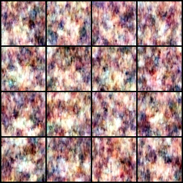
**Sample #1** - Awal pelatihan

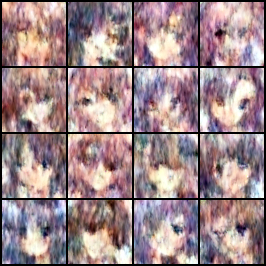
**Sample #2** - Awal pelatihan

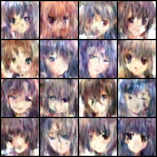
**Sample #3** - Awal pelatihan

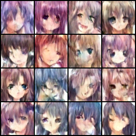
**Sample #4** - Awal pelatihan

</div>

#### Mid Training (Sample 10-15) - Kualitas Sedang
<div style="display: grid; grid-template-columns: repeat(4, 1fr); gap: 10px; margin: 20px 0;">

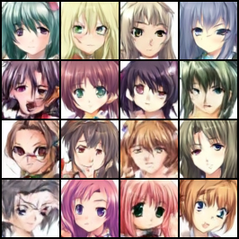
**Sample #10** - Pertengahan pelatihan

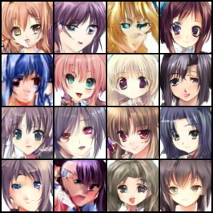
**Sample #11** - Pertengahan pelatihan

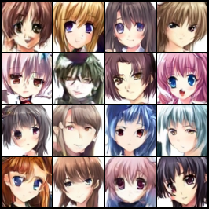
**Sample #12** - Pertengahan pelatihan

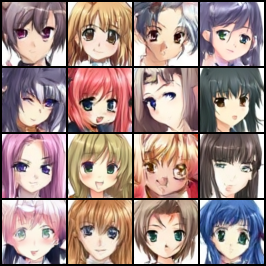
**Sample #13** - Pertengahan pelatihan

</div>

#### Late Training (Sample 25-30) - Kualitas Tinggi
<div style="display: grid; grid-template-columns: repeat(4, 1fr); gap: 10px; margin: 20px 0;">

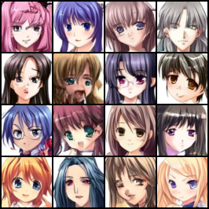
**Sample #25** - Akhir pelatihan

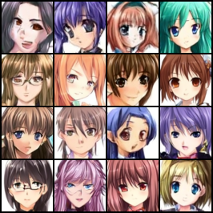
**Sample #26** - Akhir pelatihan

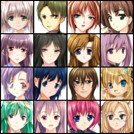
**Sample #27** - Akhir pelatihan

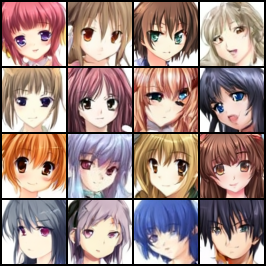
**Sample #28** - Akhir pelatihan

</div>

## Quick demo (Notebook example)

You can find a notebook example in the `notebooks` folder. Download the .ipynb file, and upload it to your Google Colab. The notebook contains a quick and easy demo to train a 2D diffusion model.

For more detailed examples, you can follow the instructions below.

## Using this repo

### Installation

If you have Anaconda, you can create a new environment with Python 3.10 and install the package in editable mode:

```bash
conda create -n tutorial python=3.10
conda activate tutorial

# Clone this github repository and go to the root folder
pip install -e .
```

## 2D diffusion model

### Unconditional diffusion model

For unconditional diffusion, you have to put the data directly under the 'data' folder.

#### Training

1. Put the images in the `data` folder
2. Run the training script

```bash
# Input your data and output dir. The channels is the number of channels in the input data
python trainer_2d.py --data-dir [data_dir] --output-dir [model_dir] [--channels 3]

```

#### Inference

1. Run the inference script

```bash
python sampler_2d.py --model-dir models
```

### Classifier-free guidance

For classifier-free guidance, you have to put the data in the 'data' folder consisting of subfolders corresponding to the different classes (e.g., 0, 1, 2, ...). The training script will then use the class labels as guidance.

Example data dir structure

```
data
├── 0
│   ├── 0.png
│   ├── 1.png
├── 1
│   ├── 0.png
│   ├── 1.png
└── 2
    ├── 0.png
    ├── 1.png
```

#### Training

```bash
python trainer_cfg_2d.py --data-dir [data_dir] --output-dir [model_dir] [--channels 3] [--num-classes 10]
```

#### Inference

```bash
python sampler_cfg_2d.py --model-dir [model_dir] [--num-classes 10]
```

## 1D diffusion model

For unconditional 1D diffusion, you need to put your data into a .h5 file with an _input_ column.

#### Training

1. Prepare your data in a HDF5 file with containing an _input_ column
2. Run the training script

```bash
# Input your data path and output dir. The seq-length is the length of the input sequence
python trainer_1d.py --input-file data.h5 --output-dir models [--seq-length 480]
```

#### Inference

1. Run the inference script

```bash
python sampler_1d.py --model-dir models
```

## 1D classifier-free guidance

For classifier-free guidance, you need to put your data into a .h5 file with an _input_ column and a _labels_ column.

#### Training

1. Prepare your data in a HDF5 file with containing an _input_ and a _labels_ column
2. Run the training script

```bash
# Input your data path and output dir. The seq-length is the length of the input sequence
python trainer_cfg_1d.py --input-file [data.h5] --output-dir [model_dir] [--seq-length 480] [--num-classes 10]
```

#### Inference

```bash
python sampler_cfg_1d.py --model-dir [model_dir] [--num-classes 10]
```
